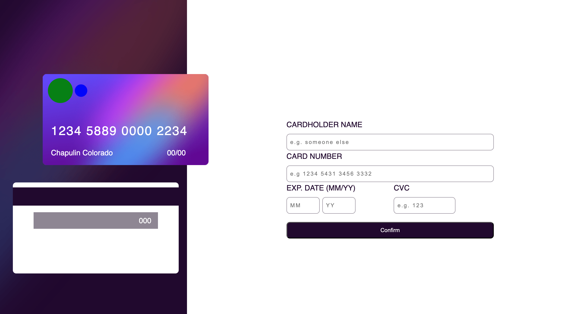

# Frontend Mentor - Interactive card details form solution

## Table of contents

- [Overview](#overview)
  - [The challenge](#the-challenge)
  - [Screenshot](#screenshot)
  - [Links](#links)
- [My process](#my-process)
  - [Built with](#built-with)
  - [What I learned](#what-i-learned)
  - [Continued development](#continued-development)
**Note: Delete this note and update the table of contents based on what sections you keep.**

## Overview

### The challenge

Users should be able to:

- Fill in the form and see the card details update in real-time
- Receive error messages when the form is submitted if:
  - Any input field is empty
  - The card number, expiry date, or CVC fields are in the wrong format
- View the optimal layout depending on their device's screen size
- See hover, active, and focus states for interactive elements on the page

### Screenshot

### Links

- Solution URL: [Github url](https://github.com/lingowmx/interactive-Card-form)
- Live Site URL: [Github pages](https://lingowmx.github.io/interactive-Card-form/)

## My process

### Built with

- Semantic HTML5 markup
- CSS custom properties
- Sass
- Flexbox
- Mobile-first workflow

### What I learned

First of all. Read the instructions and what the client is asking. 
Some regex for email validation and separation of characters in the card 
Realize that is better to work with more divisions, that makes it easy to give better and more specified styles to mobile and desktop designs

### Continued development

Keep reading more and asking less to chatgpt

